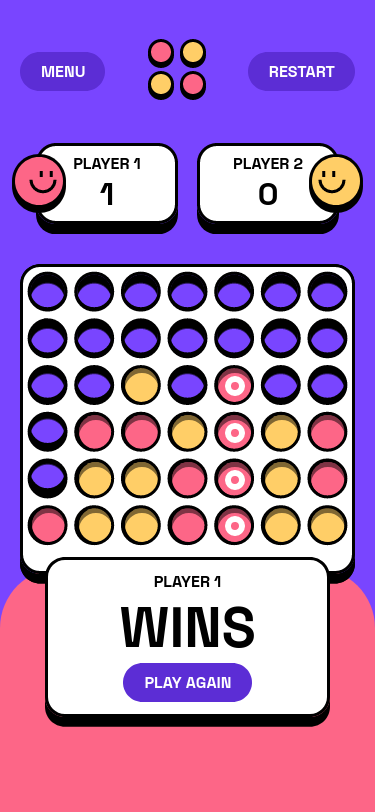

# Frontend Mentor - Connect Four game solution

This is a solution to the [Connect Four game challenge on Frontend Mentor](https://www.frontendmentor.io/challenges/connect-four-game-6G8QVH923s). Frontend Mentor challenges help you improve your coding skills by building realistic projects.

## Table of contents

- [Overview](#overview)
  - [The challenge](#the-challenge)
  - [Screenshot](#screenshot)
  - [Links](#links)
- [My process](#my-process)
  - [Built with](#built-with)
  - [What I learned](#what-i-learned)
  - [Continued development](#continued-development)
- [Author](#author)

## Overview

### The challenge

Users should be able to:

- View the game rules
- Play a game of Connect Four against another human player (alternating turns on the same computer)
- View the optimal layout for the interface depending on their device's screen size
- See hover and focus states for all interactive elements on the page
- **Bonus**: See the discs animate into their position when a move is made
- **Bonus**: Play against the computer

### Screenshot

### Links

- Solution URL: [solution URL](https://www.frontendmentor.io/solutions/connectfourgame-using-just-html-css-and-js-Oy1v0UD84w)
- Live Site URL: [live site URL](https://yassine-ramla.github.io/Connect-Four-game/)

## My process

### Built with

- Flexbox
- CSS Grid
- Mobile-first workflow

### What I learned

this was a hard one for me, may be beceause i've just used html, css and js, i can't really count the things i've learnt building this project, especially in js.

### Continued development

this is a game that contains a complex logic, it may contain some mistakes and errors either in ui or logic, i'll try to correct every problem occurred.

## Author

- Frontend Mentor - [@yassine-ramla](https://www.frontendmentor.io/profile/yassine-ramla)
- Twitter - [@yassine_ramla](https://www.twitter.com/yassine_ramla)
